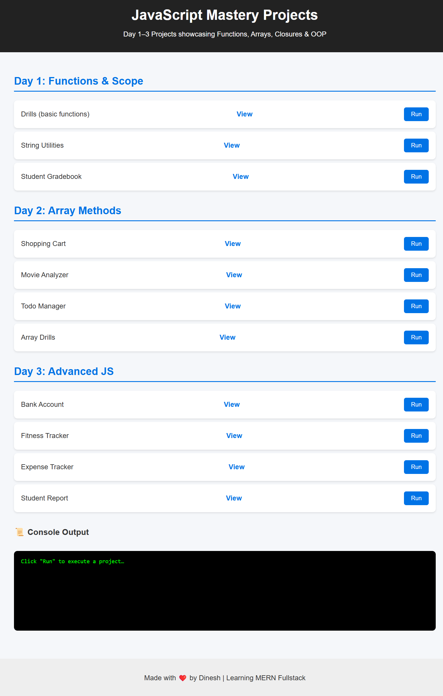

<h1 align="center">⚡ JavaScript Mastery Playground ⚡</h1>

  
  
  
  

🎉 Welcome to my <b>JavaScript Mastery Playground</b> — a collection of fun, interactive, and practical projects.  
Each project is a stepping stone in my journey to become a <b>Full-Stack Developer</b>. 🚀  

---

## 🌐 Live Showcase  

  <a href="https://dineshtm07.github.io/javascript-mastery/">
    🔗 <b>Explore All Projects Live Here!</b>
  </a>

---

## 📂 Project Dashboard  

| 🚀 Day | 🧩 Focus Area | 🎯 Projects |
|--------|--------------|-------------|
| 🟡 **Day 1** | Functions & Scope | 🎲 [Drills]   🔤 [String Utilities]   📚 [Gradebook]
) |
| 🟢 **Day 2** | Array Methods | 🛒 [Shopping Cart]   🎬 [Movie Analyzer]   ✅ [Todo Manager]  📊 [Array Drills] |
| 🔵 **Day 3** | Advanced JS | 💳 [Bank Account]   🏋️ [Fitness Tracker]   🎓 [Student Report]   💰 [Expense Tracker] |

---

## 🧠 Key Learnings  

✔️ Clean, reusable **functions**  
✔️ Deep understanding of **scope & closures**  
✔️ Mastery of **map, filter, reduce**  
✔️ Problem-solving like a **pro developer**  
✔️ Creating **scalable mini-projects**  

---

## 🛣️ Roadmap Ahead  

- 🌟 DOM Manipulation (coming soon…)  
- 🧩 Object-Oriented Programming (OOP)  
- ⚡ Asynchronous JavaScript (Promises, Async/Await)  
- 🌐 Full MERN Stack Apps  
- 🧠 LeetCode & Interview Prep  

---

## 📸 Demo & Screenshots  

Here’s a sneak peek at some projects in action:  

  
  

✨ Fun + Code + Creativity = Mastery ✨

---

## 👨‍💻 Author  

**[DINESH-GITHUB PROFILE](https://github.com/DINESHTM07)**  
💼 Aspiring **Full-Stack Developer** | MERN Enthusiast  
🔥 Motto: *“Code. Learn. Build. Repeat.”*  

  

